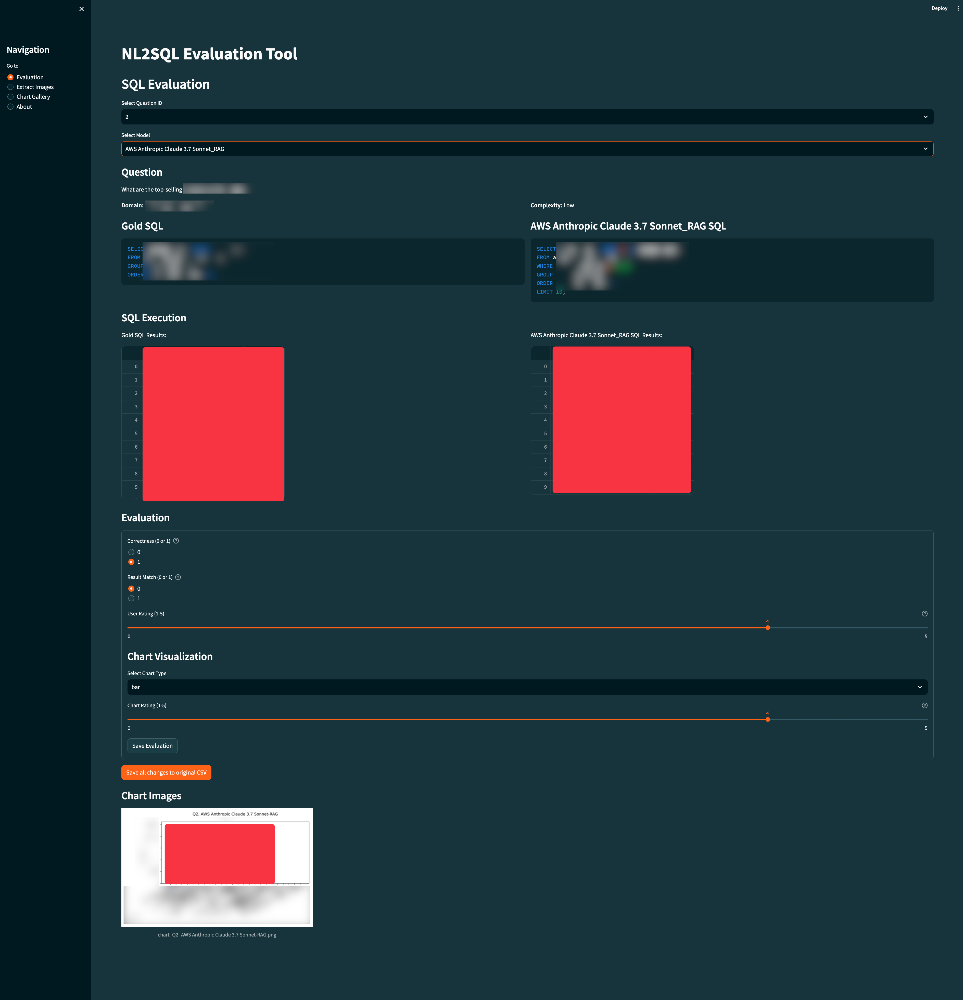

# NL2SQL Evaluation Tool

A Streamlit application for side-by-side evaluating natural language to SQL (NL2SQL) model performance.

demo image: 

## Overview

This tool allows you to:

1. Compare gold-standard SQL queries with LLM-generated SQL queries
2. Execute queries via AWS Glue to view and compare results
3. Evaluate model performance across multiple criteria
4. Visualize query results with customizable charts
5. Extract images from the attached EML file
6. Edit and save evaluation results to a CSV file

## Setup
1. Prepare eval data:
   - put the csv in root folder
   - put the eml file in root folder if you want to extract images from it; ELSE put all images in a folder named `images` in root folder
2. Install the required dependencies:
   ```
   uv pip install -r pyproject.toml
   ```

3. Configure AWS credentials:
   - Ensure you have AWS credentials set up with appropriate permissions for Glue operations.
   - copy .env.example to .env and fill in the required fields(aws database name)
4. Run the application:
   ```
   uv run streamlit run app.py
   ```
5. remember to click "Save Evaluation" in each form to save the results to the working copy
6. Click "Save All Evaluations" at the end to save the evaluations to the original csv file

## Features

### Evaluation Interface

- Load and view NL2SQL evaluation data
- Select questions and view their natural language form
- Compare gold SQL with generated SQL from different models
- Execute SQL queries against AWS Glue tables
- Visualize query results with appropriate charts
- Rate SQL correctness, result matching, user experience, and chart quality

### Image Extraction

The tool provides functionality to extract images from the attached EML file:
- Extracts and saves all image attachments
- Displays images for visual reference
- Allows downloading of extracted images

### Working Copy

To protect the original data, the application:
- Creates a working copy of the CSV file
- All edits are made to the working copy
- Provides option to save changes back to the original file when finished

## Evaluation Criteria

Evaluations are based on the following criteria:

- **Correctness (0 or 1)**: Syntactic and logical correctness of the SQL
- **ResultMatch (0 or 1)**: Whether outputs match expected results
- **UserRating (1-5)**: Subjective rating on SQL quality
- **VoiceUsed (0)**: Always set to 0 as per requirements
- **ChartRating (1-5)**: Quality of chart representation
- **AnalystChartChoice**: Preferred chart type for data visualization

## Usage Flow

1. Navigate to the Evaluation page
2. Select a question to evaluate
3. Choose a model to review its generated SQL
4. Enter AWS Glue database name to execute queries
5. Compare gold standard results with model results
6. Fill in evaluation criteria
7. Save evaluations and continue to the next question
8. When finished, save all changes to the original CSV